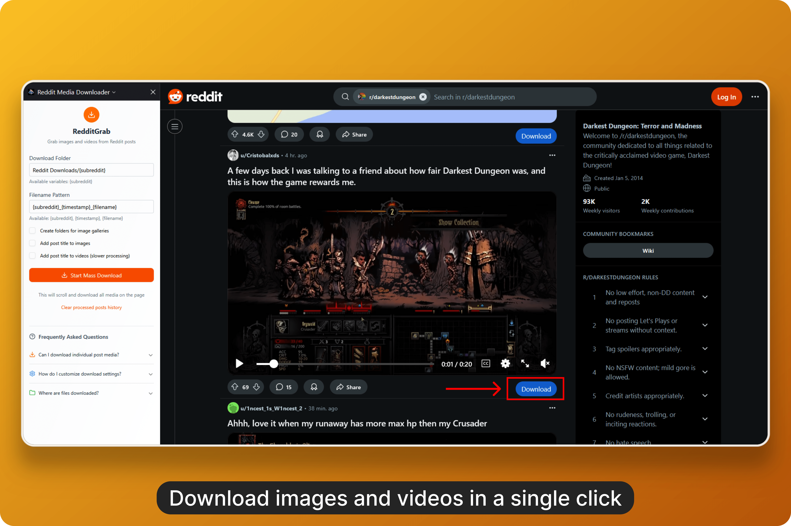
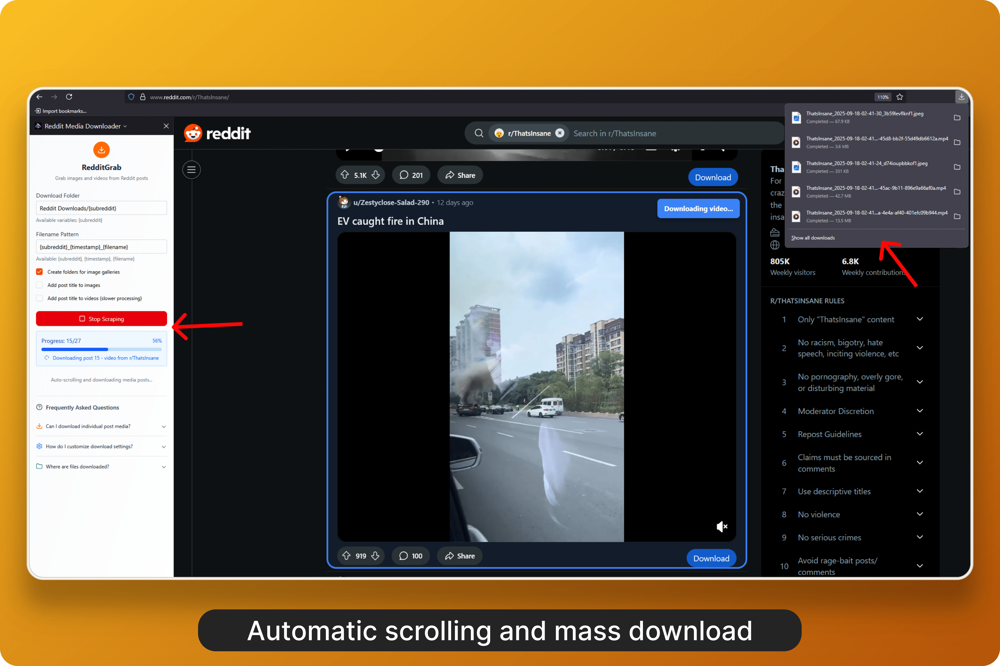

<div align="center">
  
  <h1>RedditGrab</h1>
  <p>
    <a href="https://addons.mozilla.org/en-US/firefox/addon/media-downloader-redditgrab" target="_blank">
      
    </a>
  </p>
</div>

Browser extension for downloading images and videos from Reddit posts. Supports individual downloads and mass downloading with auto-scrolling.

## Preview

https://github.com/user-attachments/assets/4295d7c0-3b2f-450c-9ec5-53dab86b150d





## Features

- Individual post downloads via injected buttons
- Mass downloads with auto-scrolling
- Customizable download settings and folder organization
- Title overlay on images and videos
- Image processing with FFmpeg

## Usage

### Individual Downloads

1. Navigate to reddit.com
2. Click the blue "Download" button on any post
3. Media downloads automatically

### Mass Downloads

1. Open the RedditGrab sidebar panel
2. Configure download settings
3. Click "Start Mass Download"

### Settings

- **Download Folder**: Where files are saved (supports `{subreddit}` variable)
- **Filename Pattern**: File naming (supports `{subreddit}`, `{timestamp}`, `{filename}`)
- **Gallery Folders**: Separate folders for image galleries
- **Title Overlay**: Add post titles to media

## Development

Built with [WXT](https://wxt.dev/) and React.

### Prerequisites

- Node.js 22+
- pnpm

#### Commands

- `pnpm dev` - Development server
- `pnpm dev:firefox` - Firefox development
- `pnpm zip` - Create distribution zip
- `pnpm zip:firefox` - Create distribution zip for Firefox

### Structure

```
entrypoints/
├── background.ts          # Background script
├── download-button.content/ # Content script
├── offscreen/             # Offscreen document (Chrome only)
└── sidepanel/             # Sidebar UI
components/                # React components
utils/                     # Utilities
public/                    # Static assets
```

## Permissions

- `downloads` - Save files
- `activeTab` - Interact with Reddit
- `storage` - Save settings
- `tabs` - Query active tab
- `offscreen` - Required for using ffmpeg.wasm in Chrome

## Privacy

No data collection:

- No analytics
- No marketing data
- All media processing is local
